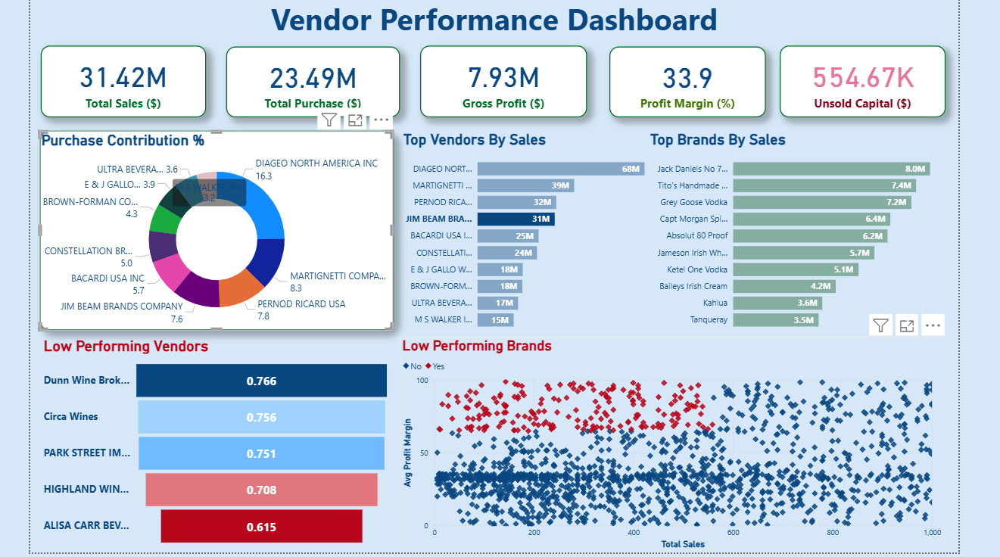

# 🏪 Vendor Performance Analysis | Retail Inventory & Sales

**Analyzing vendor efficiency and profitability to support strategic purchasing and inventory decisions using SQL, Python, and Power BI.**

---

## 📑 Table of Contents
- [Overview](#overview)
- [Business Problem](#business-problem)
- [Dataset](#dataset)
- [Tools & Technologies](#tools--technologies)
- [Project Structure](#project-structure)
- [Data Cleaning & Preparation](#data-cleaning--preparation)
- [Exploratory Data Analysis (EDA)](#exploratory-data-analysis-eda)
- [Research Questions & Key Findings](#research-questions--key-findings)
- [Dashboard](#dashboard)
- [How to Run This Project](#how-to-run-this-project)
- [Final Recommendations](#final-recommendations)
- [Author & Contact](#author--contact)

---

## 🔍 Overview
This project evaluates vendor performance and retail inventory dynamics to drive strategic insights for purchasing, pricing, and inventory optimization.  
A complete data pipeline was built using **SQL** for ETL, **Python** for analysis and hypothesis testing, and **Power BI** for visualization.

---

## 💼 Business Problem
Effective inventory and sales management are critical in the retail sector.  
This project aims to:

- Identify underperforming brands needing pricing or promotional adjustments  
- Determine vendor contributions to sales and profits  
- Analyze the cost-benefit of bulk purchasing  
- Investigate inventory turnover inefficiencies  
- Statistically validate differences in vendor profitability  

---

## 🧾 Dataset
- Multiple CSV files located in `/data/` folder (sales, vendors, inventory)  
- Summary table created from ingested data and used for analysis  

---

## 🧰 Tools & Technologies
- **SQL:** Common Table Expressions, Joins, Filtering  
- **Python:** Pandas, Matplotlib, Seaborn, SciPy  
- **Power BI:** Interactive Visualizations  
- **GitHub:** Version Control  

---

## 🗂️ Project Structure
```
vendor-performance-analysis/
│
├── README.md
├── .gitignore
├── requirements.txt
├── Vendor Performance Report.pdf
│
├── notebooks/
│ ├── Exploratory data anlaysis.ipynb
│ └── Vendor Performance Analysis.ipynb
│
├── scripts/
│ ├── ingest_db.py
│ └── get_vendor_summary.py
│
└── dashboard/
└── vendor_performance_dashboard.pbix
```


## 🧹 Data Cleaning & Preparation
- Removed transactions with:
  - Gross Profit = 0  
  - Profit Margin = 0  
  - Sales Quantity = 0  
- Created summary tables with vendor-level metrics  
- Converted data types, handled outliers, merged lookup tables  

---

## 📊 Exploratory Data Analysis (EDA)
**Negative or Zero Values Detected:**
- Gross Profit: Min = -$2,002.78 (loss-making sales)  
- Profit Margin: Min = 1% (sales at zero or below cost)  
- Unsold Inventory: Indicating slow-moving stock  

**Outliers Identified:**
- High Freight Costs (up to 257K)  
- Large Purchase/Actual Prices  

---

## 🧩 Research Questions & Key Findings
- **Brands for Promotions:** 198 brands with low sales but high profit margins  
- **Top Vendors:** Top 10 vendors = 65.69% of purchases (risk of over-reliance)  
- **Bulk Purchasing Impact:** 72% cost savings per unit in large orders  
- **Inventory Turnover:** $2.71M worth of unsold inventory  
- **Vendor Profitability:**  
  - High Vendors: Mean Margin = 31.17%  
  - Low Vendors: Mean Margin = 41.55%  
- **Hypothesis Testing:** Statistically significant difference in profit margins across vendor strategies  

---

##  Dashboard
**Power BI Dashboard Shows:**
- Vendor-wise Sales and Margins  
- Inventory Turnover  
- Bulk Purchase Savings  
- Performance Heatmaps  



---

## ⚙️ How to Run This Project
```bash
# 1. Clone the repository
git clone https://github.com/yourusername/vendor-performance-analysis.git

# 2. Load the CSVs and ingest into database
python scripts/ingestion_db.py

# 3. Create vendor summary table
python scripts/get_vendor_summary.py

# 4. Open and run notebooks
notebooks/exploratory_data_analysis.ipynb
notebooks/vendor_performance_analysis.ipynb

# 5. Open Power BI Dashboard
dashboard/vendor_performance_dashboard.pbix


## Final Recommendations

Diversify vendor base to reduce risk

Optimize bulk order strategies

Reprice slow-moving, high-margin brands

Clear unsold inventory strategically

Improve marketing for underperforming vendors
